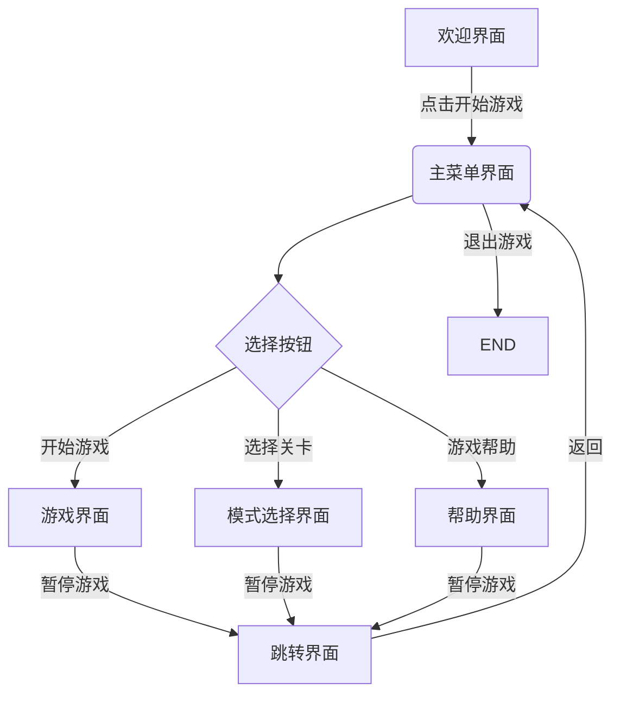

# 浅谈网络游戏设计
- 学生： 201806010108 项建航
- 单位： 浙江工业大学 计算机科学技术与软件学院/健行学院
- 联系方式： Jh_zjut@163.com
- 文章目录
    [TOC]
## 摘要
	随着人民生活水平的不断提高，大众对精神文化方面的需求越来越大。游戏程序的出现满足了人们对精神娱乐的需求，此外随着互联网、计算机、移动设备的高速发展，游戏的出现也呈现着渐进性和多样性的特点。本文主要讲述网络游戏编程的设计思路并结合一个基于cocos2d和android的植物大战僵尸案例进行分析研究。对案例的研究主要从游戏设计、代码实现解析和引擎优化等方面展开。
## 关键词
	网络游戏编程、网络游戏设计、cocos2d、引擎优化、DBNUX用户体验模型
## 1. 引言
    近期阅读了大量关于游戏程序开发的文章和博客，对游戏开发的流程有了更深的了解。此外，在学了游戏设计开发课程和移动开发课程之后，本人选择植物大战僵尸作为一个实战案例来进行分析，并在文末给出一个用户体验评价模型和一个基于ECS模式的cocos2d-x引擎优化方案。
## 2. 网络游戏简介
    近年来, 游戏产业正从传统的2D游戏、单机游戏向新兴的3D游戏和在线网络游戏发展. 而3D游戏和网络游戏的兴起就伴随着技术和算法的改变.传统的游戏设计模式也需要及时更新，从而适应大众对游戏娱乐的需求. 目前看来，游戏中的界面系统在游戏中占据了重要的地位, 一个优秀的UI界面设计可以吸引玩家的兴趣，占据市场.前段时间，本人在许多平台上看到《黑神话：悟空》的宣传视频，该游戏以其高质量的画质渲染和独特风格的界面设计吸引了大量玩家的关注。一个好的游戏不仅需要考虑其界面等服务对用户的吸引力，也要考虑其技术上的要点，比如和用户的交互性和体验感。对于网络游戏而言, 最重要的就是玩家场景的一致性和实时性. 一致性就需要建立对应的网络通信协议, 而实时性就要减少网络传书中的延迟误差。网络游戏以互联网为载体，可以通过多种形式来提高用户的游戏体验感，比如说《王者荣耀》以多人团队合作对抗为特点，又比如说《植物大战僵尸》这类游戏虽然几乎没有直接形式上的团队对抗合作，但是通过互联网设定一个排名榜单来建设一个竞争机制来吸引玩家的兴趣。

## 3. 基于cocos2d-x和android的植物大战僵尸开发
    植物大战僵尸这款游戏有许多版本，其中市场主要存在的是电脑端、手机端的《植物大战僵尸1》和《植物大战僵尸2》,恰巧本人对上述版本都有过游戏体验和了解，因此下文将结合手机端的《植物大战僵尸1》进行开发和分析。植物大战僵尸在游戏策划上主要由植物角色、僵尸角色、植物购买机制、闯关成就机制和世界排名机制等元素组成，在一定程度上吸引了玩家的兴趣，具有一定的市场。
### 3.1 功能分析
本游戏项目大概有如下功能需求：游戏角色、菜单页面、地图移动、展现僵尸/植物、选择植物框、已选植物框、选择/取消选择、开始战斗、”准备-好-开始“动画、加载僵尸、安放植物、僵尸攻击植物、植物攻击僵尸、游戏的进度展示、太阳花产生太阳、声音播放、收集太阳...
### 3.2 开发环境
- 系统层面
```
  型号名称：	MacBook Pro
  处理器名称：	八核Intel Core i9
  处理器速度：	2.3 GHz
  处理器数目：	1
  核总数：	8
  L2缓存（每个核）：	256 KB
  L3缓存：	16 MB
  超线程技术：	已启用
  内存：	32 GB

``` 
- 应用层面
```
Android Studio 4.1.2
cocos2d-x 相关jar包
```
### 3.3 游戏设计
- 设计思路    
    游戏的设计运用了cocos2d-android的CCGL-SurfaceView的主体功能实现，先建立一个场景，再在场景上添加图层，随后在图层上添加精灵，最后由导演指挥、运行。 
    本游戏事先会准备很多图片资源存储在asset文件夹中，植物坐标以二维数组的存储方式保存在特定集合中，僵尸坐标也保存于特定集合中，当游戏开始时，僵尸会从保存的坐标点中随机产生出来；而植物的产生则由玩家安放。游戏的主体界面上有类似的植物安放位置地图，是以屏幕位置划分的，用户只要单击了植物，再点击屏幕的设置范围、即可做出相应的响应。 
    游戏主要包括3个界面，游戏开始界面、游戏选择界面、游戏主体界面。游戏的界面流程图如下所示。所有非游戏界面采用了贴图或者菜单选项等显示机制，并对这些贴图或者菜单设有按钮点击事件，当用户点击时，会有相应的提示。游戏主体界面是游戏设计中游戏对象最多，需要处理的游戏线程处理最复杂的界面。

- 界面流程图

### 3.4 关键代码实现与解析

#### 3.4.1 图层创建
- 实现思路：
    这里新建一个名为layer的包，然后在该包里新建一个BaseLayer，作为所有图层的基类，在该类中通过CCDirector.sharedDirector().winSize()来获取屏幕的宽高。
    在Layer包下新建一个WelcomeLayer，用于作为欢迎界面的图层，继承BaseLayer。然后编写intitLogo()方法、showLogo()方法、showWelcome()方法，分别实现相应的逻辑。

- 代码实现：
```
/**
 * 基类图层
 */
public class BaseLayer extends CCLayer {

    /**
     * 屏幕的宽高
     */
    public CGSize size  = CCDirector.sharedDirector().winSize();

    public BaseLayer() {
    }
}

/**
 * 欢迎页面图层
 */
public class WelcomeLayer extends BaseLayer {

    /**
     * logo对象
     */
    private CCSprite logo;

    public WelcomeLayer() {
        initLogo();// 初始化logo
        showLogo(); // 展示logo
    }

    /**
     * 1.logo初始化
     */
    private void initLogo(){
        logo = CCSprite.sprite("image/popcap_logo.png");
        logo.setPosition(size.width / 2 , size.height / 2); // 屏幕居中
        this.addChild(logo);
    }

    /**
     * 2.展示logo
     */
    private void showLogo(){
        CCHide hide = CCHide.action(); // 表示隐藏动作
        CCDelayTime delay = CCDelayTime.action(1); // 延时一秒钟
        CCShow show = CCShow.action(); // 表示显示动作
        CCSequence sequence = CCSequence.actions(hide,delay,show,delay,hide,delay,CCCallFunc.action(this,"showWelcome")); // 一上来先隐藏logo，过一秒后显示logo，再过一秒钟后继续隐藏logo
        logo.runAction(sequence);
    }

    /**
     * 3.显示欢迎界面。
     */
    public void showWelcome(){
        logo.removeSelf(); // 删除logo
        CCSprite welcome = CCSprite.sprite("image/welcome.jpg"); // 初始化欢迎界面
        welcome.setAnchorPoint(0,0); // 设置锚点为左下角
        this.addChild(welcome);
    }
}

...
```
#### 3.4.2 游戏主菜单

- 实现思路：
    在Layer包下新建游戏主菜单与层MenuLayer，添加showMainMenu()方法，后续只需在图层相应按钮上添加响应事件。

- 代码实现：
```
/**
 * 菜单图层
 */
public class MenuLayer extends BaseLayer{
    public MenuLayer() {
        showMainMenu();
    }

    /**
     * 1.初始化主菜单页面
     */
    private void showMainMenu(){
        CCSprite background = CCSprite.sprite("image/menu/main_menu_bg.jpg");
        background.setAnchorPoint(0,0);
        this.addChild(background);
    }
}

...
```

#### 3.4.3 战斗场景
- 实现思路：
    在layer包下新建FightLayer，用于表示战斗场景的图层，并在loadMap()方法中加载地图;    该图层中实现了加载地图、加载僵尸、移动地图、加载植物和植物选择的功能。
    
- 代码实现：
```
/**
 * 战斗图层
 */
public class FightLayer extends BaseLayer{
    public FightLayer() {
        loadMap();
    }

    /**
     * 1.加载地图
     */
    private void loadMap(){
        CCTMXTiledMap map = CCTMXTiledMap.tiledMap("image/fight/map_day.tmx");
        this.addChild(map);
    }
}
/**
     * 2.加载僵尸的坐标点集合
     * @return
     */
    private ArrayList<CGPoint> loadZombiePoint(){
        ArrayList<CGPoint> tempPoints = new ArrayList<>();
        CCTMXObjectGroup zombies = map.objectGroupNamed("zombies");
        ArrayList<HashMap<String, String>> zombiesPoint = zombies.objects;
        for (HashMap<String, String> map : zombiesPoint) {
            Integer x  = Integer.parseInt(map.get("x"));
            Integer y  = Integer.parseInt(map.get("y"));
            tempPoints.add(ccp(x,y));
        }
        return tempPoints;
    }
**
     * 3.移动地图
     */
    private void moveMap(){
        float offset = size.width - map.getContentSize().width; // 地图移动的偏移量
        CCDelayTime delay = CCDelayTime.action(1); // 延时1秒
        CCMoveBy move = CCMoveBy.action(2,ccp(offset,0));
        CCSequence sequence = CCSequence.actions(delay,move);
        map.runAction(sequence);
    }
    /**
     * 4.展示植物框
     */
    public void showPlantBox(){
        showSelectedBox();
        showChooseBox();
    }

    /**
     * 5.展示植物选择框（已选）
     */
    private void showSelectedBox(){
        mSelectedBox = CCSprite.sprite("image/fight/chose/fight_chose.png");
        mSelectedBox.setAnchorPoint(0,1); // 设置锚点为左上角
        mSelectedBox.setPosition(0,size.height);
        this.addChild(mSelectedBox);
    }

    /**
     * 6.展示植物选择框（未选）
     */
    private void showChooseBox(){
        mChooseBox = CCSprite.sprite("image/fight/chose/fight_choose.png");
        mChooseBox.setAnchorPoint(0,0); // 设置锚点为左下角
        this.addChild(mChooseBox);

        String format = "image/fight/chose/choose_default%02d.png";
        for (int i = 1; i <= 9 ; i++) {
            CCSprite plant = CCSprite.sprite(String.format(format,i));
            float x = (i - 1) % 4 * 54 + 16; // 计算x坐标
            float y = 175 - (i - 1) / 4 * 59; // 计算y坐标
            plant.setAnchorPoint(0,0); // 设置锚点为左下角
            plant.setPosition(x,y);
            mChooseBox.addChild(plant);
        }
    }
```
#### 3.4.4 战斗逻辑
- 实现思路：
    新建一个engine包，在包下创建GameEngine类，并且将该类设置为单例模式.
    修改FightLineEngine，添加attackPlant()方法表示僵尸和植物处在同一个x轴上时僵尸开始攻击植物.
- 代码实现：
```
/**
 * 处理战斗逻辑的引擎
 * 单例类
 */
public class GameEngine {

    /**
     * 单例对象
     */
    private static GameEngine mInstance = new GameEngine();

    /**
     * 游戏地图
     */
    private CCTMXTiledMap map;

    /**
     * 已选植物
     */
    private CopyOnWriteArrayList<Plant> mSelectedPlants;

    /**
     * 标记游戏是否正式开始
     */
    public static boolean isStart;

    public GameEngine() {
    }

    public static GameEngine getInstance(){
        return mInstance;
    }

    /**
     * 1.游戏开始的一些处理
     * @param map 游戏地图
     * @param selectedPlants 已选植物
     */
    public void gameStart(CCTMXTiledMap map,CopyOnWriteArrayList<Plant> selectedPlants){
        isStart = true;
        this.map = map;
        this.mSelectedPlants = selectedPlants;
    }

    /**
     * 2.专门处理点击事件
     * @param event
     */
    public void handleTouch(MotionEvent event){

    }
}


```
```
**
 * 封装战线的引擎类
 */
public class FightLineEngine {

    /**
     * 保存植物对象的Map
     */
    private HashMap<Integer,Plant> mPlants = new HashMap<>(); // key表示植物在第几列

    /**
     * 保存僵尸对象的集合
     */
    private CopyOnWriteArrayList<Zombie> mZombies = new CopyOnWriteArrayList<>();

    public FightLineEngine(int i) {

        CCScheduler scheduler = CCScheduler.sharedScheduler();
        scheduler.schedule("attackPlant",this,0.2f,false); // 每隔0.2秒检测僵尸是否可以攻击植物
    }

    /**
     * 1.添加植物
     * @param plant 植物对象
     */
    public void addPlant(Plant plant){
        mPlants.put(plant.getColumn(),plant);
    }

    /**
     * 2.判断战线上是否已经有植物，有的话就不能再安放了
     * @return
     */
    public boolean contaionsPlant(Plant plant){
        return mPlants.keySet().contains(plant.getColumn());
    }


    /**
     * 3.添加僵尸
     * @param zombie 僵尸对象
     */
    public void addZombie(final Zombie zombie){
        // 僵尸的死亡回调
        zombie.setDieListener(new BaseElement.DieListener() {
            @Override
            public void die() {
                mZombies.remove(zombie); // 僵尸死亡后从集合中移除
            }
        });
        mZombies.add(zombie);
    }

    /**
     * 4.僵尸攻击植物
     * @param f
     */
    public void attackPlant(float f){
        if (!mPlants.isEmpty() && !mZombies.isEmpty()){
            for (Zombie zombie : mZombies) {
                int column = (int) (zombie.getPosition().x / 46 - 1) ;
                if(mPlants.keySet().contains(column)){ // 僵尸当前所在的列上有植物存在
                    if (!zombie.isAttacking()){
                        zombie.attack(mPlants.get(column));// 表示僵尸开始攻击该列的植物
                        zombie.setAttacking(true);  // 标记正在攻击
                    }
                }
            }
        }
    }
}
```

#### 3.4.5 战斗场景的进度条
- 实现思路：
    修改GameEngine，添加progress()方法，代表进度器的逻辑，并修改gameStart()方法，在游戏开始时显示进度条，再修改loadZombies()方法，让每加载一只僵尸就让进度+5.
- 代码实现：
```
    /**
     * 定义进度器
     */
    private CCProgressTimer progressTimer;
    /**
     * 僵尸加载的进度
     */
    private int progress;
    /**
     * 1.游戏开始的一些处理
     * @param map 游戏地图
     * @param selectedPlants 已选植物
     */
    public void gameStart(CCTMXTiledMap map,CopyOnWriteArrayList<Plant> selectedPlants){
        isStart = true;
        this.map = map;
        this.mSelectedPlants = selectedPlants;
        mZombiePoints = CommonUtil.loadPoint(map, "road");
        // 定时器
        CCScheduler scheduler = CCScheduler.sharedScheduler();
        scheduler.schedule("loadZombie",this,2,false); //每隔两秒执行一次loadZombie()方法
        loadPlant();
        progress(); // 在游戏开始时显示进度条
    }
    /**
     * 3.加载僵尸
     * @param f 必须有的参数，不然CCScheduler无法通过反射调用
     */
    public void loadZombie(float f) {
        Random random = new Random();
        int line = random.nextInt(5); // 随机数为0,1,2,3,4
        CGPoint startPoint = mZombiePoints.get(line * 2); // 起点坐标
        CGPoint endPoint = mZombiePoints.get(line * 2 + 1); // 终点坐标
        PrimaryZombie zombie = new PrimaryZombie(startPoint,endPoint);
        map.addChild(zombie,1);
        mFightLines.get(line).addZombie(zombie); // 把僵尸添加到战线中
        progress += 5; // 每加载一个僵尸，让加载进度+5
        progressTimer.setPercentage(progress); // 更新进度条进度
    }
    /**
     * 6.进度条
     */
    private void progress() {
        progressTimer = CCProgressTimer.progressWithFile("image/fight/progress.png");

        progressTimer.setPosition(CCDirector.sharedDirector().getWinSize().width - 70, 13);
        map.getParent().addChild(progressTimer);
        progressTimer.setScale(0.6f);
        // 0-100
        progressTimer.setPercentage(0);// 每增加一个僵尸需要调整进度，增加5 0-100
        // 设置样式
        progressTimer.setType(CCProgressTimer.kCCProgressTimerTypeHorizontalBarLR);

        CCSprite sprite = CCSprite.sprite("image/fight/flagmeter.png");
        sprite.setPosition(CCDirector.sharedDirector().getWinSize().width - 70, 13);
        map.getParent().addChild(sprite);
        sprite.setScale(0.6f);
        CCSprite name = CCSprite.sprite("image/fight/FlagMeterLevelProgress.png");
        name.setPosition(CCDirector.sharedDirector().getWinSize().width - 70, 5);
        map.getParent().addChild(name);
        name.setScale(0.6f);
    }


```
#### 3.4.6 MainActivity
- 实现思路：
    这里只要按照android项目的逻辑修改相应的Activity即可，将基于cocos2d-x的植物大战僵尸游戏布置到安卓移动设备上。
- 代码实现：
```
public class MainActivity extends AppCompatActivity {

    /**
     * 导演
     */
    CCDirector director = CCDirector.sharedDirector();

    @Override
    protected void onCreate(Bundle savedInstanceState) {
        super.onCreate(savedInstanceState);

        //调用顺序：视图（CCGLSurfaceView） -》 导演（CCDirector） -》 场景（CCScene） -》 图层（CCLayer） -》 精灵（CCSprite） -》 动作（CCMove）

        // 获取视图
        CCGLSurfaceView view = new CCGLSurfaceView(this); // 创建一个SurfaceView,类似导演眼前的小屏幕，必须传this，底层要强转成Actvity
        setContentView(view);

        // 获取导演的单例对象
        director.attachInView(view); // 开启绘制线程的方法
        director.setDisplayFPS(true); // 显示帧率，表示每秒刷新页面的次数。一般当帧率大于30帧时，基本上人眼看起来比较流畅，帧率和手机性能与程序性能有关
        director.setAnimationInterval(1/60f); // 设置最高帧率位60
        director.setDeviceOrientation(CCDirector.kCCDeviceOrientationLandscapeLeft); // 设置屏幕方式为横屏显示
        director.setScreenSize(480,320); // 设置分辨率，用于屏幕适配，会基于不同大小的屏幕等比例缩放，设置我们开发时候的分辨率

        // 获取场景对象
        CCScene scene = CCScene.node();

        // 获取图层对象
        //FirstLayer layer = new FirstLayer();
        //ActionLayer layer = new ActionLayer();
        DemoLayer layer = new DemoLayer();

        // 配置环境
        scene.addChild(layer); // 给场景添加图层
        director.runWithScene(scene); // 导演运行场景
    }

    @Override
    protected void onResume() {
        super.onResume();
        director.resume(); // 游戏继续
        SoundEngine.sharedEngine().resumeSound(); // 音乐继续
    }

    @Override
    protected void onPause() {
        super.onPause();
        director.pause(); // 游戏暂停
        SoundEngine.sharedEngine().pauseSound(); // 音乐暂停
    }

    @Override
    protected void onDestroy() {
        super.onDestroy();
        director.end(); // 游戏结束
    }
}


```

## 4. 关于cocos2d引擎的优化
### 4.1 游戏开发中的ECS模式（以cocos2d为例）
#### 4.1.1 问题引入
    通常在使用继承来进行游戏开发编程时会这样带来的问题：游戏对象的逻辑往往在超类中被定死了，而一旦需要对逻辑作出修改，要么重写实现，要么继承基类进行覆盖。此外，在C++中使用对象池优化时就会造成灾难性的后果：一种类型一个池（尽管可以用通用的内存分配器，但是这样还要考虑内存碎片等杂七杂八的问题）。对于传统的设计思路，在游戏开发上就会导致“类灾难”。于是ECS模式被提了出来，用于解决继承带来的问题。
#### 4.1.2 ECS介绍
    ECS模式类似与软件设计模式中的组件模式，为了解决继承导致的开发问题，我们可以采取组合的形式来替代。ECS，即 Entity-Component-System（实体-组件-系统） 的缩写，其模式遵循组合优于继承原则，游戏内的每一个基本单元都是一个实体，每个实体又由一个或多个组件构成，每个组件仅仅包含代表其特性的数据（即在组件中没有任何方法），例如：移动相关的组件MoveComponent包含速度、位置、朝向等属性，一旦一个实体拥有了MoveComponent组件便可以认为它拥有了移动的能力，系统便是来处理拥有一个或多个相同组件的实体集合的工具，其只拥有行为（即在系统中没有任何数据），在这个例子中，处理移动的系统仅仅关心拥有移动能力的实体，它会遍历所有拥有MoveComponent组件的实体，并根据相关的数据（速度、位置、朝向等），更新实体的位置。实体与组件是一个一对多的关系，实体拥有怎样的能力，完全是取决于其拥有哪些组件，通过动态添加或删除组件，可以在（游戏）运行时改变实体的行为。
#### 4.1.3 cocos2d-x的缺陷和解决思路
1. 在使用 Cocos2d-X 开发的游戏中，数据与逻辑之间的相互依赖使得开发者经常
需要对代码做出不小的改动才可满足迭代过程中频繁变更的游戏需求。对此，分别将游
戏世界中的对象、数据和行为抽象为 ECS 中的实体、组件以及系统，使用位数组和顺
序存储结构降低游戏数据与逻辑间的耦合，使开发者能够以组合的方式构建游戏对象，
从而方便快速地对游戏功能进行扩展或修改。 
2. 当开发交互实时性要求较高的游戏时，Cocos2d-X 在性能方面的限制容易导致游
戏出现卡顿等性能问题。对此，建立内存管理机制提高游戏数据的内存申请与释放速度，
并结合模板元编程技术减少游戏运行过程中的性能开销；基于程序局部性原理，通过提
升计算机缓存命中率提高 Cocos2d-X 的数据读写效率，提升游戏性能。 

### 4.2 基于ECS的cocos2d-x引擎优化方案
- 简单优化方案  
    通过利用 ECS 架构模式中“实体代表游戏对象、组件代表游戏对象含有的属性、系统负责对不同类型的组件进行读写”的三大设计原则，对原先 Cocos2d-X引擎采用的游戏对象模型和游戏对象更新策略进行了重新定义： (1)原先用于模拟游戏世界中所有游戏对象的 Node 对象以及表示其内部各种状态的数据现在都被视为组件(图中分别以 NodeComponent 和 DataComponent 表示)，各类游戏对象改用 ECS 架构模式中的实体(即标识符 ID)来模拟。 (2)Node 中负责更新游戏对象状态的行为(逻辑)现在由 ECS 中的系统(System)负责执行。这些系统分为两类，第一类负责对象状态更新前的相关计算工作，比如坐标、速率、生命值的变化(图中以 LogicSystem 表示)；第二类负责根据前者的计算结果，从NodeComponent 中取得 Cocos2d-X 引擎中的相应 Node 指针以完成最后的游戏对象状态更新工作(以 UpdateSystem 表示)。采用优化方案前后 Cocos2d-X 引擎中与游戏对象相关的架构策略对比如下表所示： 
    

    |  | 游戏对象构建 | 游戏对象模拟 | 游戏对象状态更新 |
    | --- | --- | --- | --- |
    | 优化前 | 继承Node | Node对象 | 以对象为中心逐一更新 |
    | 优化后 | 组合组件 | 标识符ID(实体) | 以数据为中心批量、连续地更新 |

- 方案优点：
以上基于 ECS 架构模式设计的优化方案具备以下优点： 
(1)与传统的继承相比，新的基于组合的游戏对象构建方式能为代码带来更好的可扩展性。当使用 Cocos2d-X 引擎的开发者希望创建一种新的游戏对象时，可以利用 ECS架构模式中实体是组件的集合的特性，在现有基础上提供新的组件组合方案，或是定义新的组件类型。由于游戏对象本身只是一个标识符 ID，而且组件内部没有任何行为，极大减少了游戏对象之间复杂的继承或依赖关系的出现。 
(2)原先表示游戏对象状态的数据从 Node 对象内部转移到了不同类型的组件中，因此能够利用组件只包含数据的特点，为这些组件设计更加高效的内存管理方案，从而提升游戏数据的读写效率。 
(3)Cocos2d-X 的游戏对象更新现在由负责处理游戏世界中不同逻辑的系统(System)完成，它们都只读写指定类型的组件，整个过程不会发生频繁的虚函数调用，减少了为实现运行时多态而付出的性能代价。另外，各个系统对组件内部数据的读写是批量而且连续的，若能使组件在内存中的分布符合程序局部性的要求，便能以提升游戏运行过程中的计算机缓存命中率的方式进一步提升游戏性能。 
(4)现在程序员能在 Cocos2d-X 的调度器 Scheduler 中对游戏世界中的某种逻辑注册一个更新回调(比如与对象相关的移动逻辑、碰撞逻辑等)，而不是对该逻辑的某个游戏对象注册更新回调。开发者只需关心这些逻辑的执行优先级，不用再把精力耗费在游戏对象优先级的划分上，从而进一步改善游戏代码的可扩展性和可维护性。 
## 5. 基于DBN的用户体验模型
### 5.1 DBNUX简单介绍    
    在一个网络游戏代码开发结束之后，显然我们需要进行各种测试，此处我想介绍的是对用户游戏体验研究的一个模型。
    为了更直观、有效地评估游戏产品的用户体验，消除单一评估标准的不确定性。方法从传统的MDA游戏设计的角度出发，引入用户的生理特征测量，构建基于动态贝叶斯网络的用户体验评估模型。该模型通过MDAUX框架提取用户体验影响因子，作为贝叶斯网络的输入层节点，通过生理特征测量方法提取用户的脑电和眼动状态，作为贝叶斯网络输出层节点，以一阶隐马尔可夫模型表示两个相邻时间片上用户体验元素的影响关系，从而动态地展示用户体验状态。
### 5.2 用户体验因子的选择
    为明确游戏设计流程，提取用户体验影响因子，基于游戏开发的MDA框架理论，将游戏产品的技术要求（如数据交换、网络环境等）整合至设计要求中，即功能机制、动态调节和美学需求，建立基于MDA的MDAUX框架。MDAUX框架大致分为3层：功能层、结构和表现层。功能层的游戏机制是指游戏本身的运行机制、奖励机制等；结构层指动态调节的游戏结构，包括交互设计和信息架构，交互设计即关于游戏的可操作部分的设计，信息架构指游戏中的角色行为、战斗调节（游戏中的人工智能）等；表现层指游戏设计的美学需求，包括玩家直观感受到的视觉设计和听觉设计。
### 5.3 DBNUX构建流程
    为了建立基于生理特征测量的离散 DBN 用户体验模型，第一步是指定离散 DBN 的节点，即指定用于构建离散 DBN 网络的输入层变量、隐藏变量和输出层变量；第二步是确定离散变量的数值类型；第三步是配置变量的初始状态，即在时间 t=1 时计算 SBN；最后一步是计算随时间变化的条件概率并推断游戏玩家的用户体验。一个 DBN 可以被认为是连续时间片相互连接的 SBN 的集合，并且两个相邻时间片之间的关系由 HMM 建模。
    模型构建流程大致如下图：

### 5.4 模型讨论
    在本文引入DBNUX模型的主要目的是为了提供一个测试用户体验的模型工具，本人对该模型就不详细介绍了。模型可以以一阶 HMM 表示相邻时间片的影响关系，通过收集用户脑电和眼动信息，推测出用户当前使用状态，消除单一指标预测的不稳定性，将用户体验研究数理模型化，对游戏产品用户体验的高效评估具有参考价值。设计者基于证据变量可推断出当前用户的体验状态，并根据概率分布情况来合理安排各设计模块的投入资源。
    在一个游戏设计开发完成之后必然要进行用户体验的测试，通过这样的一个数学模型可以定量地分析用户的体验感，并可以在一定程度上预测其他玩家的游戏体验感。
## 6. 参考资料
- 参考文献
[1]袁飘逸.基于cocos2d-android的“植物大战僵尸”游戏研发[J].软件,2018,39(08):174-177.

[2]吴晓雪,何南,缪新颖,王魏.基于Cocos2d-x引擎的移动游戏设计与应用[J].现代电子技术,2018,41(24):106-109+113.

[3]刘贤梅,刘俊,贾迪.Unity引擎下多人在线网络游戏的设计与开发[J].计算机系统应用,2020,29(05):103-109.

[4]苏珂,续鲁庆.游戏设计中基于DBN的用户体验评估模型研究[J].包装工程,2020,41(02):231-236+248.

[5]申良柱. 基于ECS的Cocos2d-X引擎优化设计与实现[D].东南大学,2019.

- 参考博客
[1]疯狂代码. 网络游戏设计[Z/OL]. 疯狂代码. 
[2]lovoo. cocos2d植物大战僵尸游戏解析[Z/OL]. CSDN,2016.
[3]DXT00. 游戏开发中的ECS模式[Z/OL]. CSDN，2019.
[4]白夜wn. 游戏开发中的ECS架构[Z/OL]. CSDN，2020.
